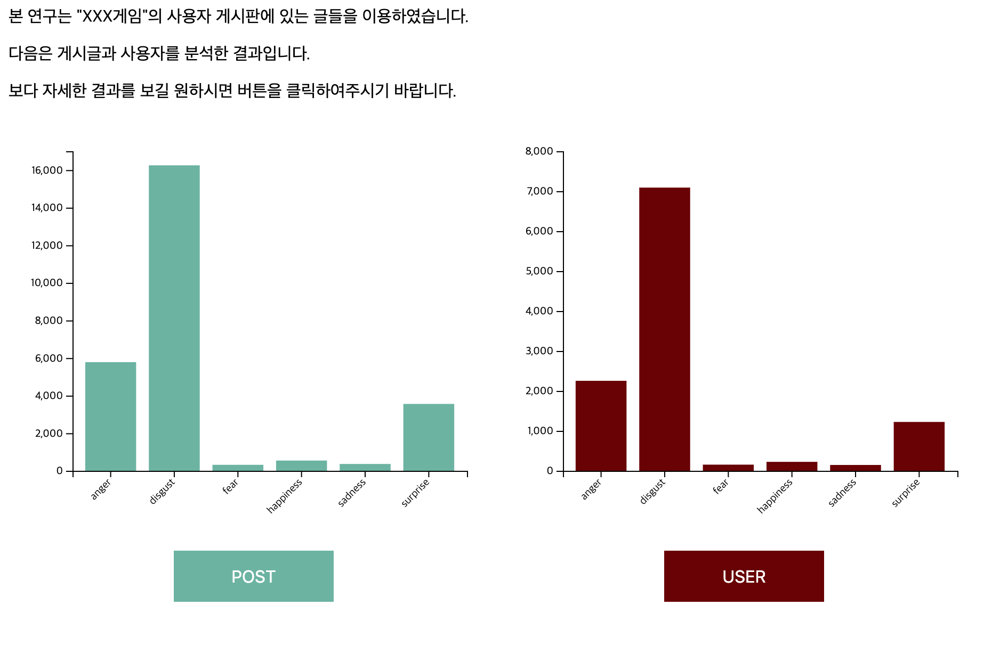
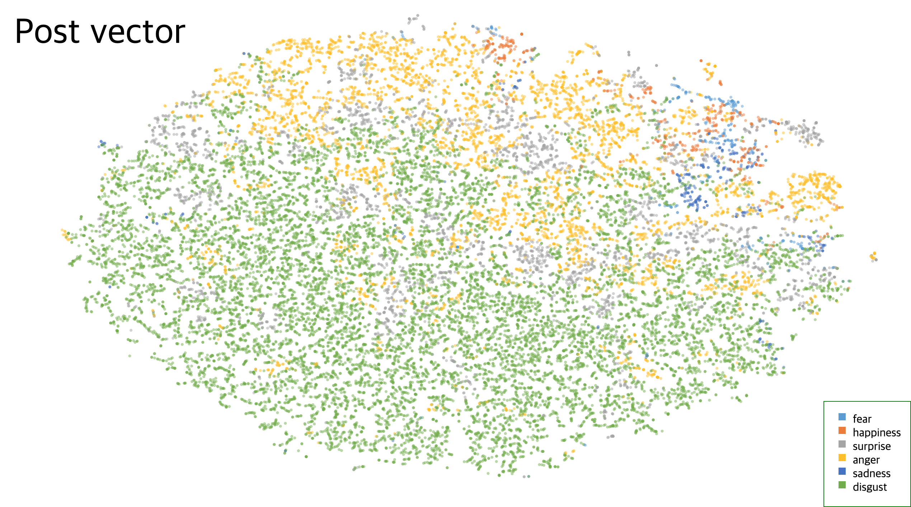

EAoP-Visualization
======================

# 1. virtualenv설치
	$ pip install virtualenv
	$ virtualenv venv

# 2. virtualenv 환경 구축
먼저 virtualenv 환경을 시행합니다.

	$ source venv/bin/activate

이후 requirements.txt 에 있는 모든 항목들을 설치합니다

	$ pip install -r requirements.txt

# 3. Flask 실행
	$ cd pyflask
	$ python app.py

