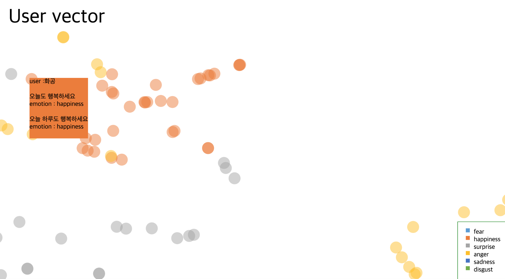

EAoP(Emotion Analysis of Posts)
===============================

EAoP는 인터넷 커뮤니티 게시글의 감정 분석을 위해 의존 구문 분석정보를 반영하고 이를 Word embedding 하여 각 게시글과 감정의 가까운 정도를 측정하는 모델입니다. 

# Requirements

## 1. Mecab
EAoP는 POS tagging을 위해 [Mecab](https://bitbucket.org/eunjeon/mecab-ko-dic/src/master/)을 사용합니다. 
기존의 Mecab은 C 기반으로 만들어졌기 때문에 파이썬에서 사용하려면 아래와 같이 설치해야합니다. 

1.1 C 드라이브에 mecab 폴더 만들기 "C:/mecab"
1.2 윈도우 버전에 맞는 [mecab-ko-msvc](https://github.com/Pusnow/mecab-ko-msvc/releases/tag/release-0.9.2-msvc-3) 다운로드 & "C:/mecab" 폴더에서 압축 풀기
1.3 [mecab-ko-dic-msvc 기본 사전](https://github.com/Pusnow/mecab-ko-dic-msvc/releases/tag/mecab-ko-dic-2.1.1-20180720-msvc) 다운로드 & "C:/mecab" 폴더에서 압축 풀기
1.4 파이썬 및 윈도우 버전에 맞는 [python wheel](https://github.com/Pusnow/mecab-python-msvc/releases/tag/mecab_python-0.996_ko_0.9.2_msvc-2) 다운로드 & site-package 폴더에 옮기기
1.5 cmd 창에서 site-package 폴더로 이동 & pip install 다운로드받은파일명.whl 을 입력하여 설치
예시) 
	$ pip install mecab_python-0.996_ko_0.9.2_msvc-cp35-cp35m-win_amd64.whl

참조 : <https ://cleancode ws.tistory.com/97>

## 2. ETRI API
EAoP는 의존구문분석을 위해 ETRI에서 개발한 [의존구문분석 API](http://aiopen.etri.re.kr/guide_wiseNLU.php#group01)를 사용합니다.
해당 API를 사용하기 위해서는 Key를 발급받아야합니다. Key 발급 관련 링크는 [여기](http://aiopen.etri.re.kr/key_main.php)에서 확인할 수 있습니다.

ETRI API에서 Key 발급을 받았다면 Preprocessor/3-1. make_raw_ETRI_data.py의 ETRI_analyzer의 openApiURL과 accessKey 부분에 본인의 정보를 입력하시면 됩니다.

'''
def ETRI_analyzer(text, analysisCode):
    openApiURL = "????????"
    accessKey = "????????"
'''

## 3. Soynlp Word Extracter
EAoP는 신조어와 비속어, 기타 단어가 많이 등장하는 인터넷 커뮤니티 게시글을 타겟으로 설정하였습니다. 따라서 기존의 사전에 존재하지 않는 신조어와 비속어, 기타 단어를 찾아내는 과정이 필요합니다.
EAoP는 [Soynlp Word Extractor](https://github.com/lovit/soynlp)를 사용하여 단어라고 추측되는 단어 후보군을 찾아냅니다.
Soynlp는 pip를 통해 간단하게 설치할 수 있습니다.

	$ pip install soynlp 

## 4. glove-python
EAoP는 Co-occurrence matrix를 기반으로 vector embedding을 하는 [GloVe(Global Vectors for Word Representation)](https://nlp.stanford.edu/projects/glove/)를 사용합니다. 
GloVe 연구진은 [C로 구현된 코드](https://github.com/stanfordnlp/GloVe)를 공개하였습니다. 파이썬 환경에서 GloVe를 사용하려면 pip를 통해 [glove_python](https://github.com/maciejkula/glove-python)을 설치할 수 있습니다.

	$ pip install glove_python

## 5. Data
5.1 인터넷 커뮤니티 게시글
5.2 사용자 사전 : Soynlp Word Extracter를 통해 생성한 단어 이외에도 추가하고자 하는 단어
5.3 감정기준단어 사전 : Preprocessor/emotion word.csv를 기본적으로 제공, 사용자가 추가 및 삭제 가능

# Run EAoP

EAoP 코드는 크게 Preprocessor, Vector calculator & Emotion Analyzer 그리고 Visualization으로 구성되어 있습니다. 

## Preprocessor
EAoP의 Input 데이터인 인터넷 커뮤니티 게시글을 Preprocessing하는 코드입니다.  
EAoP의 Preprocessor는 사용자 사전 생성, POS tagging, 의존구문분석을 수행합니다.
코드의 실행순서는 각 py파일 앞 숫자 번호과 같습니다.

Preprocessor를 통해 사용자 사전에 추가할 단어가 정해지면 mecab의 사전 형식에 따라 csv 파일을 만들고 이를 추가해야합니다.
mecab 사용자 사전 추가 방법은 아래와 같습니다. 

1. Notepad++를 통해 사용자 사전 csv 파일 생성
2. 해당 파일을 mecab/user-dic로 이동
3. 관리자 권한으로 Poweshell 실행
	$ cd C:\mecab
	$ Set-ExecutionPolicy unrestricted
	$ .\tools\add-userdic-win.ps1

Mecab의 사전 형식 및 추가 방법은 [여기](https://bitbucket.org/eunjeon/mecab-ko-dic/src/df15a487444d88565ea18f8250330276497cc9b9/final/user-dic/README.md)를 참고하시길 바랍니다. 

## Vector calculator & Emotion Analyzer
EAoP의 Vector calculator & Emotion Analyzer는 Preprocessing된 데이터를 이용하여 Vector embedding을 수행하고 각 감정을 기준으로 한 벡터를 생성합니다. 
실행 코드는 main.py이며 main_functions.py에 main 함수를 실행하기 위한 다양한 함수들이 구현되어 있습니다.

## Visualization

### 1. virtualenv설치
	$ pip install virtualenv
	$ virtualenv venv

### 2. virtualenv 환경 구축
먼저 virtualenv 환경을 시행합니다.

	$ source venv/bin/activate

이후 requirements.txt 에 있는 모든 항목들을 설치합니다

	$ pip install -r requirements.txt

### 3. Flask 실행
	$ cd pyflask
	$ python app.py

### 4. Visualization 실행화면

첫 화면은 다음과 같습니다.

아래와 같은 화면을 얻기 위해서는 컴퓨터 환경에 설치된 mysql DB위에 데이터를 util/_tsv2mysql.py 파일을 이용하여 넣어야합니다.

